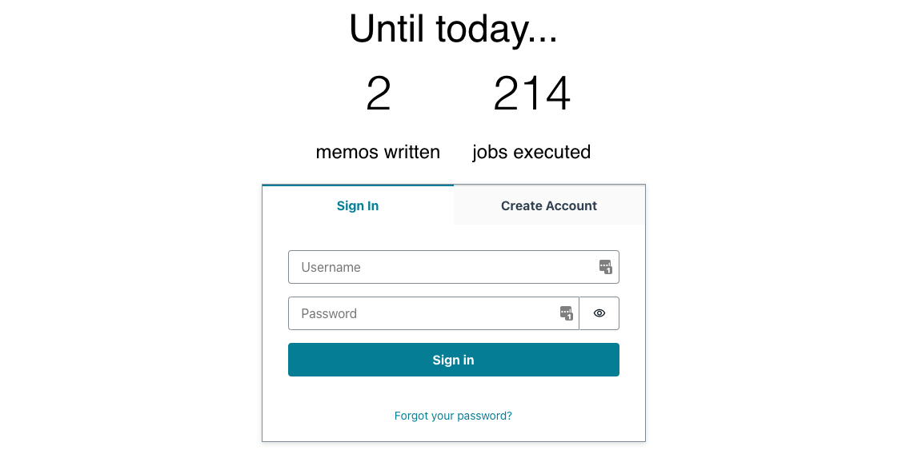
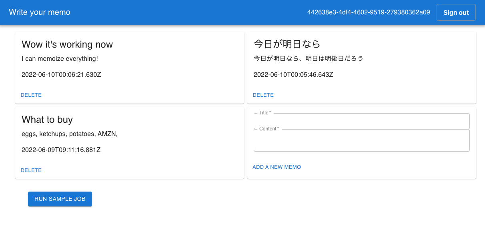

# Serverless Full Stack WebApp Starter Kit
[](https://github.com/aws-samples/serverless-full-stack-webapp-starter-kit/actions/workflows/build.yml)

This is a full stack webapp kit for starters who want to leverage the power of AWS serverless services!

Features include:

* Express API endpoint (both with and without authentication)
* React.js frontend (assets are delivered via CDN)
* E-mail authentication
* Asynchronous job queue
* Scheduled job runner
* Instant deployment of the entire app

## Overview
Here is the architecture of this kit. We use:

* [Amazon DynamoDB](https://aws.amazon.com/dynamodb/), a serverless scalable NoSQL database
* [Amazon API Gateway HTTP API](https://aws.amazon.com/api-gateway/) + [AWS Lambda](https://aws.amazon.com/lambda/) to build serverless API endpoint ([`serverless-express`](https://github.com/vendia/serverless-express))
* [Amazon CloudFront](https://aws.amazon.com/cloudfront/) + [S3](https://aws.amazon.com/s3/) to distribute frontend assets (React.js, Amplify libraries, MUI)
* [Amazon Cognito](https://aws.amazon.com/cognito/) for authentication. By default, you can sign in/up by email, but you can federate with other OIDC providers such as Google, Facebook, and more with a little modification.
* [Amazon SQS](https://aws.amazon.com/sqs/) + AWS Lambda for asynchronous job queue. 
* [Amazon EventBridge](https://aws.amazon.com/eventbridge/) to run scheduled jobs. 
* [Amazon CloudWatch](https://aws.amazon.com/cloudwatch/) + S3 for access logging.
* [AWS CDK](https://aws.amazon.com/cdk/) for Infrastructure as Code. It enables you to deploy the entire application with the simplest commands.


Since it fully leverages AWS serverless services, you can use it with high cost efficiency, scalability, and almost no heavy lifting of managing servers! In terms of cost, we further discuss how much it costs in the below [#Cost](#cost) section.

### About the sample app
To show how this kit works, we include a sample web app to write and store your memos.
With this sample, you can easily understand how each component works with other ones, and what the overall experience will be like.


Here is a sign in/up page. Note that you can still get data from public API endpoints since it requires no authentication.
<br clear="right"/>


After a successful login, you can now freely add, delete, and view your own memos.
To demonstrate an asynchronous job feature, we also placed a button to run a asynchronous job. Currently, it does not have any actual effect, but when you push a button it sends a request to enqueue the job and a job will be invoked.

<br clear="left"/>

You can further improve this sample or remove all the specific code and write your own app. But first let's deploy this sample as-is!

## Deploy
You need the following tools to deploy this sample:

* [Node.js](https://nodejs.org/en/download/) (>= v16)
* [Docker](https://docs.docker.com/get-docker/)
* [AWS CLI](https://docs.aws.amazon.com/cli/latest/userguide/getting-started-install.html) and a configured IAM profile

Then run the following commands:

```sh
cd cdk
npm ci
npx cdk bootstrap
npx cdk deploy
```

Initial deployment usually takes about 10 minutes. You can also use `npx cdk deploy` command to deploy when you modified your CDK templates in the future.

After a successful deployment, you will get a CLI output like the below:

```
 ✅  ServerlessFullstackWebappStarterKitStack

✨  Deployment time: 235.21s

Outputs:
ServerlessFullstackWebappStarterKitStack.AuthUserPoolClientId8216BF9A = xxxxxxxxxxxx
ServerlessFullstackWebappStarterKitStack.AuthUserPoolIdC0605E59 = ap-northeast-1_xxxxxxx
ServerlessFullstackWebappStarterKitStack.BackendApiBackendApiUrl4A0A7879 = https://xxxxxx.execute-api.ap-northeast-1.amazonaws.com
ServerlessFullstackWebappStarterKitStack.FrontendDomainName = https://xxxxxxxxxx.cloudfront.net
Stack ARN:
arn:aws:cloudformation:ap-northeast-1:123456789012:stack/ServerlessFullstackWebappStarterKitStack/e47a02d0-e40a-11ec-8ea7-0ed955f95f17
```

Opening the URL in `FrontendDomainName` output, you can now try the sample app on your browser.

## Add your own features
To implement your own features, you may want to add frontend pages, backend API endpoints, or async jobs. The frontend is an ordinary React.js application, so you can follow the conventional ways to add pages to it. As for backend, there are step-by-step guides to add features in [backend/README.md](backend/README.md), so please follow the guide.

If you want to add another authentication method such as Google or Facebook federation, you can follow this document: [Add social sign-in to a user pool](https://docs.aws.amazon.com/cognito/latest/developerguide/cognito-user-pools-configuring-federation-with-social-idp.html).

## Local development
To develop frontend or backend locally, please refer to each `README.md` in the subdirectories:

* [Frontend](./frontend/README.md)
* [Backend](./backend/README.md)

Instead of running the backend API on your local environment, you can use `cdk watch` feature for development by just running the following command:

```sh
cd cdk
npx cdk watch
```

`cdk watch` allows you to instantly deploy your backend as soon as you change the code and "tail" logs from your Lambda functions,  enabling rapid iteration cycles.　See [this blog for more details](https://aws.amazon.com/blogs/developer/increasing-development-speed-with-cdk-watch/).

Using `cdk watch`, you will access the deployed AWS resources from your local frontend. You have to configure environment variables in [frontend/.env](./frontend/.env) file to properly access these resources. Please refer to [Frontend README](./frontend/README.md) for more details.

## Cost
API Gateway, Lambda, SQS, CloudWatch, CloudFront, and S3 offer free tier plans, which allows you to use those services almost freely for small businesses.
Up to one million requests per month, most of the costs related to those services are free. See [this page for more details](https://aws.amazon.com/free/).

DynamoDB is billed basically by how many read and write counts processed. See [this page for the current prices](https://aws.amazon.com/dynamodb/pricing/on-demand/). DynamoDB provisioned capacity mode also offers free tier plans, so if you want to pay the minimal cost, you can switch the billing mode (see [database.ts](cdk/lib/constructs/database.ts)).

Other costs will be derived from data transfer and Elastic Container Repository (used for Docker Lambda). Although it usually does not cost much compared to other services, you may want to continuously monitor the billing metrics. Please refer to [the document to set CloudWatch alarm for AWS charges](https://docs.aws.amazon.com/AmazonCloudWatch/latest/monitoring/monitor_estimated_charges_with_cloudwatch.html).

## Clean up
To avoid incurring future charges, clean up the resources you created.

You can remove all the AWS resources deployed by this sample running the following command:

```sh
cd cdk
npx cdk destroy --force
```

## Security
See [CONTRIBUTING](CONTRIBUTING.md#security-issue-notifications) for more information.

## License
This library is licensed under the MIT-0 License. See the LICENSE file.
