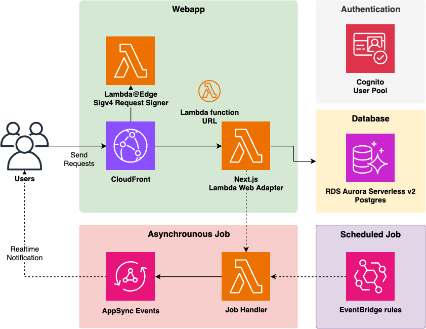
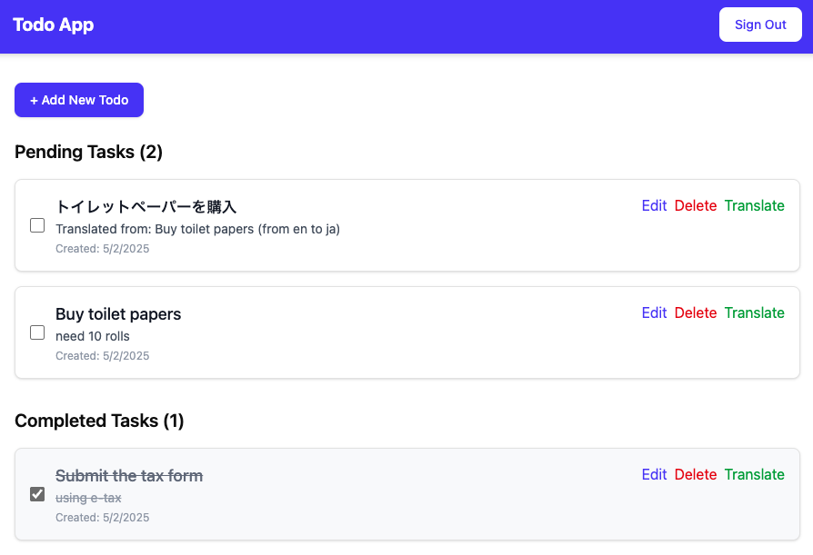

# Serverless Full Stack WebApp Starter Kit
[](https://github.com/aws-samples/serverless-full-stack-webapp-starter-kit/actions/workflows/build.yml)

This is a full stack webapp kit for starters who want to leverage the power of AWS serverless services!

Features include:

* Next.js App Router on AWS Lambda
* CloudFront + Lambda function URL with response stream support
* End to end type safety from client to server
* Cognito authentication
* Real-time notification from server to client
* Asynchronous job queue
* Instant deployment of the entire app with a single command

You can refer to [the blog article](https://tmokmss.github.io/blog/posts/serverless-fullstack-webapp-architecture-2025/) for more details (Also [Japanese version](https://tmokmss.hatenablog.com/entry/serverless-fullstack-webapp-architecture-2025).)

## Overview
Here is the architecture of this kit. We use:

* [Amazon Aurora PostgreSQL Serverless v2](https://aws.amazon.com/rds/aurora/serverless/), a serverless relational database with Prisma ORM
* [Next.js App Router](https://nextjs.org/docs/app) on [AWS Lambda](https://aws.amazon.com/lambda/) for a unified frontend and backend solution
* [Amazon CloudFront](https://aws.amazon.com/cloudfront/) + Lambda Function URL with response streaming support for efficient content delivery
* [Amazon Cognito](https://aws.amazon.com/cognito/) for authentication. By default, you can sign in/up by email, but you can federate with other OIDC providers such as Google, Facebook, and more with a little modification.
* [AWS AppSync Events](https://docs.aws.amazon.com/appsync/latest/eventapi/event-api-welcome.html) + AWS Lambda for asynchronous job and real-time notification.
* [Amazon EventBridge](https://aws.amazon.com/eventbridge/) to run scheduled jobs.
* [Amazon CloudWatch](https://aws.amazon.com/cloudwatch/) + S3 for access logging.
* [AWS CDK](https://aws.amazon.com/cdk/) for Infrastructure as Code. It enables you to deploy the entire application with the simplest commands.



Since it fully leverages AWS serverless services, you can use it with high cost efficiency, scalability, and almost no heavy lifting of managing servers! In terms of cost, we further discuss how much it costs in the below [#Cost](#cost) section.

### About the sample app
To show how this kit works, we include a sample web app to manage your todo list.
With this sample, you can easily understand how each component works with other ones, and what the overall experience will be like.


Here is a sign in/up page. This will redirect you to Cognito Managed login page.
<br clear="right"/>


After a successful login, you can now freely add, delete, and view your todo items.
To demonstrate an asynchronous job feature, we also placed a button to run a asynchronous translation job. After the invocation, the task sends an event to the event bus and your frontend automatically refreshes to fetch the translated items.

<br clear="left"/>

You can further improve this sample or remove all the specific code and write your own app. But first let's deploy this sample as-is!

## Deploy
You need the following tools to deploy this sample:

* [Node.js](https://nodejs.org/en/download/) (>= v20)
* [Docker](https://docs.docker.com/get-docker/)
* [AWS CLI](https://docs.aws.amazon.com/cli/latest/userguide/getting-started-install.html) and a configured IAM profile

Before deployment, you can update the configuration variables in [`bin/cdk.ts`](cdk/bin/cdk.ts). Please read the comments in the code.

Then run the following commands:

```sh
cd cdk
npm ci
npx cdk bootstrap
npx cdk deploy --all
```

Initial deployment usually takes about 20 minutes. You can also use `npx cdk deploy` command to deploy when you modified your CDK templates in the future.

After a successful deployment, you will get a CLI output like the below:

```
 ✅  ServerlessWebappStarterKitStack

✨  Deployment time: 407.12s

Outputs:
ServerlessWebappStarterKitStack.AuthUserPoolClientId8216BF9A = xxxxxxxxxxxxxxxxxx
ServerlessWebappStarterKitStack.AuthUserPoolIdC0605E59 = us-west-2_xxxxxx
ServerlessWebappStarterKitStack.DatabaseDatabaseSecretsCommandF4A622EB = aws secretsmanager get-secret-value --secret-id DatabaseClusterSecretD1FB63-xxxxxxx --region us-west-2
ServerlessWebappStarterKitStack.DatabasePortForwardCommandC3718B89 = aws ssm start-session --region us-west-2 --target i-xxxxxxxxxx --document-name AWS-StartPortForwardingSessionToRemoteHost --parameters '{"portNumber":["5432"], "localPortNumber":["5432"], "host": ["foo.cluster-bar.us-west-2.rds.amazonaws.com"]}'
ServerlessWebappStarterKitStack.FrontendDomainName = https://web.exmaple.com
```

Opening the URL in `FrontendDomainName` output, you can now try the sample app on your browser.

## Add your own features
To implement your own features, you may want to add frontend pages, API routes, or async jobs. The project uses Next.js App Router, which provides a unified approach for both frontend and backend development. You can follow the conventional Next.js patterns to add pages and API routes. For more details, please refer to the [`webapp/README.md`](./webapp/README.md) guide.

If you want to add another authentication method such as Google or Facebook federation, you can follow this document: [Add social sign-in to a user pool](https://docs.aws.amazon.com/cognito/latest/developerguide/cognito-user-pools-configuring-federation-with-social-idp.html).

## Local development
To develop the webapp locally, please refer to the [`webapp/README.md`](./webapp/README.md).

Before running webapp locally, you have to populate .env.local by the following steps:

```sh
cp .env.local.example .env.local
# edit .env.local using the stack outputs shown after cdk deploy 
```

## Cost

The following table provides a sample cost breakdown for deploying this system in the us-east-1 (N. Virginia) region for one month (when deployed using less expensive configuration).

| Service | Usage Details | Monthly Cost [USD] |
|---------|--------------|-------------------|
| Aurora Serverless v2 | 0.5 ACU × 2 hour/day, 1GB storage | 3.6 |
| Cognito | 100 MAU (Monthly Active Users) | 1.5 |
| AppSync Events | 100 events/month, 10 hours connection/user/month | 0.02 |
| Lambda | 512MB×200ms/request | 0.15 |
| Lambda@Edge | 128MB×50ms/request | 0.09 |
| VPC | NAT Instance (t4g.nano) x1 | 3.02 |
| EventBridge | Scheduler 100 jobs/month | 0.0001 |
| CloudFront | Data transfer 1kB/request | 0.01 |
| Total | | 8.49 |

Notes:
- Assumes 100 users per month and 1000 requests per user
- Actual costs may vary depending on usage patterns

Costs could be further reduced by leveraging Free Tier benefits where applicable. Lambda, SQS, CloudWatch, CloudFront, EC2, and Cognito offer free tier plans, which allows you to use those services almost freely for small businesses. See [this page for more details](https://aws.amazon.com/free/).

## Clean up
To avoid incurring future charges, clean up the resources you created.

You can remove all the AWS resources deployed by this sample running the following command:

```sh
cd cdk
npx cdk destroy --force
```

## Security
See [CONTRIBUTING](CONTRIBUTING.md#security-issue-notifications) for more information.

## License
This library is licensed under the MIT-0 License. See the LICENSE file.
