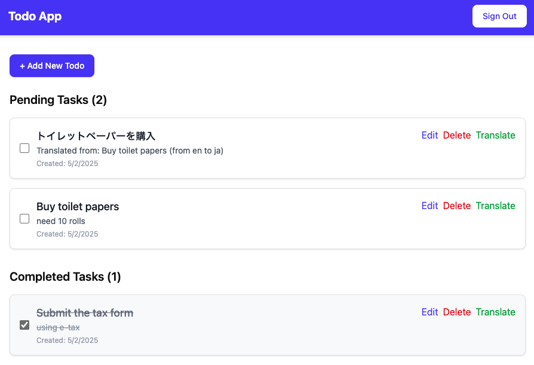
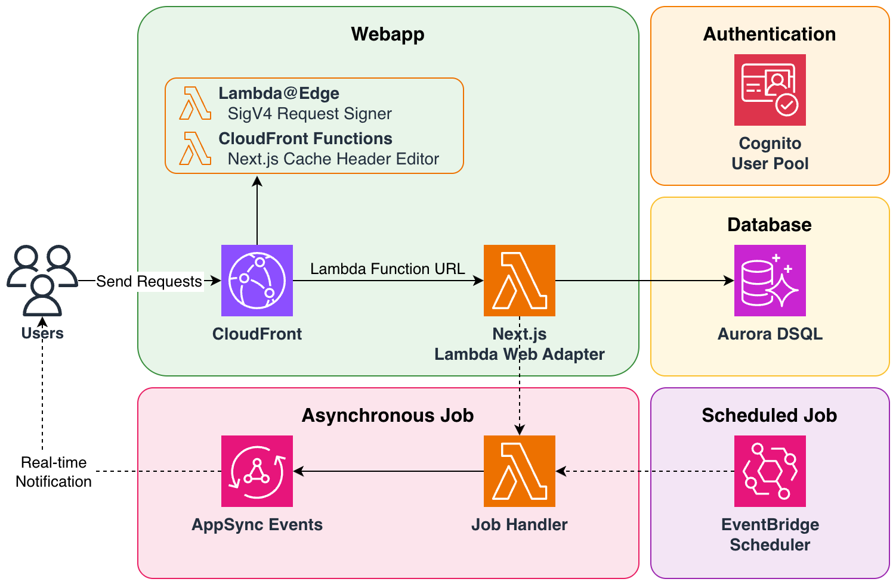

# Serverless Full Stack WebApp Starter Kit
[](https://github.com/aws-samples/serverless-full-stack-webapp-starter-kit/actions/workflows/build.yml)
[](https://github.com/aws-samples/serverless-full-stack-webapp-starter-kit/releases)

A serverless full-stack web app template you **copy and grow into your own app**. Not a framework — you own every file.

Copy, deploy with a single command, then replace the sample todo app with your own features.

## What you get

1. **Working sample app** — A todo app with authentication, DB CRUD, async jobs, and real-time notifications wired end-to-end. Designed as a readable reference for AI coding agents and humans alike.
2. **End-to-end type safety** — Types flow from Prisma ORM through Zod schemas and Server Actions to React components in a single chain.
3. **Serverless from day one** — Fully serverless architecture starting under $10/month that scales without operational overhead.
4. **Integrated DB migration** — Schema migration is integrated into the CDK deploy process via CDK Trigger, providing a development-to-production path out of the box.

You can refer to [the blog article](https://tmokmss.github.io/blog/posts/serverless-fullstack-webapp-architecture-2025/) for more details (also [Japanese version](https://tmokmss.hatenablog.com/entry/serverless-fullstack-webapp-architecture-2025)).

## Sample app

The kit includes a simple todo app to demonstrate how all components work together.


Sign in/up page redirects to Cognito Managed Login.
<br clear="left"/>

&nbsp;


After login, you can add, delete, and manage your todo items. The translate button triggers an async job and pushes a real-time notification to refresh the page.
<br clear="left"/>

## Architecture



| Service | Role |
|---------|------|
| [Aurora PostgreSQL Serverless v2](https://aws.amazon.com/rds/aurora/serverless/) | Relational database with Prisma ORM |
| [Next.js App Router](https://nextjs.org/docs/app) on [Lambda](https://aws.amazon.com/lambda/) | Unified frontend and backend |
| [CloudFront](https://aws.amazon.com/cloudfront/) + Lambda Function URL | Content delivery with response streaming |
| [Cognito](https://aws.amazon.com/cognito/) | Authentication (email by default, OIDC federation supported) |
| [AppSync Events](https://docs.aws.amazon.com/appsync/latest/eventapi/event-api-welcome.html) + Lambda | Async jobs and real-time notifications |
| [EventBridge](https://aws.amazon.com/eventbridge/) | Scheduled jobs |
| [CloudWatch](https://aws.amazon.com/cloudwatch/) + S3 | Access logging |
| [CDK](https://aws.amazon.com/cdk/) | Infrastructure as Code |

Fully serverless — high cost efficiency, scalability, and minimal operational overhead.

## Getting started

Prerequisites:
* [Node.js](https://nodejs.org/) (>= v20)
* [Docker](https://docs.docker.com/get-docker/)
* [AWS CLI](https://docs.aws.amazon.com/cli/latest/userguide/getting-started-install.html) with a configured IAM profile

### 1. Copy the kit

Use the GitHub template ("Use this template" button) or clone and copy:

```sh
git clone https://github.com/aws-samples/serverless-full-stack-webapp-starter-kit.git my-app
cd my-app
rm -rf .git && git init
# Record the kit version in your initial commit for future reference
git add -A && git commit -m "Initial commit from serverless-full-stack-webapp-starter-kit vX.Y.Z"
```

### 2. Customize (optional)

- Update the application name (stack name, tags) in [`cdk/bin/cdk.ts`](cdk/bin/cdk.ts)
- Set a custom domain in `cdk/bin/cdk.ts`
- Remove `cdk.context.json` from `cdk/.gitignore` and commit it (recommended for your own project)
- Switch from `prisma db push` to `prisma migrate` if you need migration history

### 3. Deploy

```sh
cd cdk
npm ci
npx cdk bootstrap
npx cdk deploy --all
```

Initial deployment takes about 20 minutes. After success, you'll see:

```
 ✅  ServerlessWebappStarterKitStack

Outputs:
ServerlessWebappStarterKitStack.FrontendDomainName = https://web.example.com
ServerlessWebappStarterKitStack.DatabaseSecretsCommand = aws secretsmanager get-secret-value ...
ServerlessWebappStarterKitStack.DatabasePortForwardCommand = aws ssm start-session ...
```

Open the `FrontendDomainName` URL to try the sample app.

> **Note:** `DatabasePortForwardCommand` establishes a local connection to your RDS database, and `DatabaseSecretsCommand` retrieves database credentials from Secrets Manager.

### 4. Add your own features

See [`AGENTS.md`](./AGENTS.md) for development guide — local development setup, authentication patterns, async job setup, DB migration, and coding conventions.

To add social sign-in (Google, Facebook, etc.), see [Add social sign-in to a user pool](https://docs.aws.amazon.com/cognito/latest/developerguide/cognito-user-pools-configuring-federation-with-social-idp.html).

## Maintenance policy

This kit follows [Semantic Versioning](https://semver.org/). Since users copy (not fork) this kit, breaking changes are introduced as new major versions without a lengthy deprecation cycle.

## Cost

Sample cost breakdown for us-east-1, one month, with cost-optimized configuration:

| Service | Usage Details | Monthly Cost [USD] |
|---------|--------------|-------------------|
| Aurora Serverless v2 | 0.5 ACU × 2 hour/day, 1GB storage | 3.6 |
| Cognito | 100 MAU | 1.5 |
| AppSync Events | 100 events/month, 10 hours connection/user/month | 0.02 |
| Lambda | 1024MB × 200ms/request | 0.15 |
| Lambda@Edge | 128MB × 50ms/request | 0.09 |
| VPC | NAT Instance (t4g.nano) × 1 | 3.02 |
| EventBridge | Scheduler 100 jobs/month | 0.0001 |
| CloudFront | Data transfer 1kB/request | 0.01 |
| **Total** | | **8.49** |

Assumes 100 users/month, 1000 requests/user. Costs could be further reduced with [Free Tier](https://aws.amazon.com/free/).

## Clean up

```sh
cd cdk
npx cdk destroy --force
```

## Maintainers
* [Kenji Kono (konokenj)](https://github.com/konokenj)

### Core contributors
* [Masashi Tomooka (tmokmss)](https://github.com/tmokmss) — original author
* [Kazuho Cryer-Shinozuka (badmintoncryer)](https://github.com/badmintoncryer)

## Contributing

See [CONTRIBUTING.md](CONTRIBUTING.md) for guidelines.

Contributors (human and AI) **must** read [`.serverless-full-stack-webapp-starter-kit/design/DESIGN_PRINCIPLES.md`](./.serverless-full-stack-webapp-starter-kit/design/DESIGN_PRINCIPLES.md) before making changes. It defines the design decisions and constraints that govern this kit.

## Security
See [CONTRIBUTING](CONTRIBUTING.md#security-issue-notifications) for more information.

## License
This library is licensed under the MIT-0 License. See the LICENSE file.
