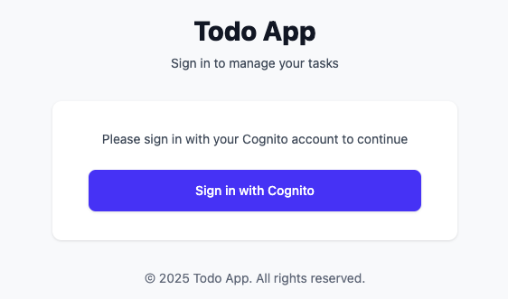

# Serverless Full Stack WebApp Starter Kit

[](https://github.com/aws-samples/serverless-full-stack-webapp-starter-kit/actions/workflows/build.yml)
[](https://github.com/aws-samples/serverless-full-stack-webapp-starter-kit/releases)

A serverless full-stack web app template you **copy and grow into your own app**. Not a framework — you own every file.

Copy, deploy with a single command, then replace the sample todo app with your own features.

## What you get

1. **Working sample app** — A todo app with authentication, DB CRUD, async jobs, and real-time notifications wired end-to-end. Designed as a readable reference for AI coding agents and humans alike.
2. **End-to-end type safety** — Types flow from Drizzle ORM through Zod schemas and Server Actions to React components in a single chain.
3. **Serverless from day one** — Fully serverless architecture starting under $10/month that scales without operational overhead.
4. **Integrated DB migration** — Schema migration is integrated into the CDK deploy process via CDK Trigger, providing a development-to-production path out of the box.

You can refer to [the blog article](https://tmokmss.github.io/blog/posts/serverless-fullstack-webapp-architecture-2025/) for more details (also [Japanese version](https://tmokmss.hatenablog.com/entry/serverless-fullstack-webapp-architecture-2025)).

## Sample app

The kit includes a simple todo app to demonstrate how all components work together.


Sign in/up page redirects to Cognito Managed Login.
<br clear="left"/>

&nbsp;


After login, you can add, delete, and manage your todo items. The translate button triggers an async job and pushes a real-time notification to refresh the page.
<br clear="left"/>

## Architecture

<!-- Source: .starter-kit/docs/imgs/architecture.drawio -->


| Service                                                                                               | Role                                                         |
| ----------------------------------------------------------------------------------------------------- | ------------------------------------------------------------ |
| [Aurora DSQL](https://aws.amazon.com/rds/aurora/dsql/)                                                | Serverless distributed SQL database with Drizzle ORM         |
| [Next.js App Router](https://nextjs.org/docs/app) on [Lambda](https://aws.amazon.com/lambda/)         | Unified frontend and backend                                 |
| [CloudFront](https://aws.amazon.com/cloudfront/) + Lambda Function URL                                | Content delivery with response streaming                     |
| [Cognito](https://aws.amazon.com/cognito/)                                                            | Authentication (email by default, OIDC federation supported) |
| [AppSync Events](https://docs.aws.amazon.com/appsync/latest/eventapi/event-api-welcome.html) + Lambda | Async jobs and real-time notifications                       |
| [EventBridge](https://aws.amazon.com/eventbridge/)                                                    | Scheduled jobs                                               |
| [CloudWatch](https://aws.amazon.com/cloudwatch/) + S3                                                 | Access logging                                               |
| [CDK](https://aws.amazon.com/cdk/)                                                                    | Infrastructure as Code                                       |

Fully serverless — no VPC required, high cost efficiency, scalability, and minimal operational overhead.

## Getting started

Prerequisites:

- [Node.js](https://nodejs.org/) (>= v22)
- [pnpm](https://pnpm.io/) (>= v10.26)
- [AWS CLI](https://docs.aws.amazon.com/cli/latest/userguide/getting-started-install.html) with a configured IAM profile

### 1. Copy the kit

Use the GitHub template ("Use this template" button) or clone and copy:

```sh
git clone https://github.com/aws-samples/serverless-full-stack-webapp-starter-kit.git my-app
cd my-app
rm -rf .git && git init
# Record the kit version in your initial commit for future reference
git add -A && git commit -m "Initial commit from serverless-full-stack-webapp-starter-kit vX.Y.Z"
```

### 2. Customize (optional)

- Update the application name (stack name, tags) in [`apps/cdk/bin/cdk.ts`](apps/cdk/bin/cdk.ts)
- Set a custom domain in `apps/cdk/bin/cdk.ts`
- Remove `cdk.context.json` from `apps/cdk/.gitignore` and commit it (recommended for your own project)
- Delete the `.starter-kit/` directory (kit maintainer docs) and the "Contributing to the kit itself" section in [`AGENTS.md`](AGENTS.md) — they apply only to the upstream kit repository

### 3. Deploy

```sh
pnpm install
cd apps/cdk
pnpm exec cdk bootstrap
pnpm exec cdk deploy --all
```

Initial deployment takes about 15 minutes. After success, you'll see:

```
 ✅  ServerlessWebappStarterKitStack

Outputs:
ServerlessWebappStarterKitStack.FrontendDomainName = https://web.example.com
ServerlessWebappStarterKitStack.DatabaseClusterEndpoint = <cluster>.dsql.<region>.on.aws
```

Open the `FrontendDomainName` URL to try the sample app.

> [!NOTE]
> If the first deploy fails with `UPDATE_ROLLBACK_FAILED` on the migration Custom Resource (for example, `Lambda is initializing your function` or DSQL "waking up cluster"), retry once:
>
> ```sh
> aws cloudformation continue-update-rollback --stack-name ServerlessWebappStarterKitStack
> pnpm exec cdk deploy --all
> ```
>
> This can happen when the container-image Lambda has not finished initialising or the DSQL cluster is still waking up. The migrator and its trigger both retry transparently on subsequent deploys; this recovery path is only needed if the very first attempt lost the race.

### 4. Enroll in the CloudFront Free plan

The kit deploys a WAF Web ACL because CloudFront [flat-rate pricing plans](https://aws.amazon.com/cloudfront/pricing/) require one. In the CloudFront console, open your distribution and choose **Manage subscription → Free plan** (1M requests + 100 GB/month, no extra cost). Plan enrollment is not supported by CDK, so this is a one-time manual step.

> [!WARNING]
> Until you enroll, the Web ACL is billed at [standard AWS WAF prices](https://aws.amazon.com/waf/pricing/) (~$5/month + $1/month per rule). Enroll in the Free plan to bundle WAF at no extra cost, or [remove the Web ACL](#cloudfront-flat-rate-pricing-plan) if you don't want it.

### 5. Add your own features

See [`AGENTS.md`](./AGENTS.md) for development guide — local development setup, authentication patterns, async job setup, DB migration, and coding conventions.

To add social sign-in (Google, Facebook, etc.), see [Add social sign-in to a user pool](https://docs.aws.amazon.com/cognito/latest/developerguide/cognito-user-pools-configuring-federation-with-social-idp.html).

## Agentic coding

This kit is designed to work well with AI coding agents. The following setup is recommended.

### Aurora DSQL skill

Install the [Aurora DSQL skill](https://docs.aws.amazon.com/aurora-dsql/latest/userguide/SECTION_aurora-dsql-steering.html) to give your agent DSQL-specific knowledge (schema design, migration patterns, constraints):

```sh
npx skills add awslabs/mcp --skill dsql
```

### Lint and format on save

This kit uses [oxlint](https://oxc.rs/) + [oxfmt](https://oxc.rs/docs/guide/usage/formatter) — Rust-based linter and formatter fast enough to run on every file write without noticeable delay. Set up a post-write hook in your AI coding agent to get instant feedback:

```sh
oxlint --config oxlintrc.json --fix <file>
oxfmt --write <file>
```

## Maintenance policy

This kit follows [Semantic Versioning](https://semver.org/). Since users copy (not fork) this kit, breaking changes are introduced as new major versions without a lengthy deprecation cycle.

## Cost

Sample cost breakdown for us-east-1, one month, with cost-optimized configuration:

| Service        | Usage Details                                    | Monthly Cost [USD] |
| -------------- | ------------------------------------------------ | ------------------ |
| Aurora DSQL    | 1M read RPUs, 0.5M write RPUs, 1GB storage       | 0.65               |
| Cognito        | 100 MAU                                          | 1.50               |
| AppSync Events | 100 events/month, 10 hours connection/user/month | 0.02               |
| Lambda         | 1024MB × 200ms/request                           | 0.15               |
| Lambda@Edge    | 128MB × 50ms/request                             | 0.09               |
| EventBridge    | Scheduler 100 jobs/month                         | 0.00               |
| CloudFront     | Data transfer 1kB/request                        | 0.01               |
| **Total**      |                                                  | **2.42**           |

Assumes 100 users/month, 1000 requests/user. Costs could be further reduced with [Free Tier](https://aws.amazon.com/free/). No VPC or NAT costs — DSQL uses IAM authentication over the public internet.

### CloudFront flat-rate pricing plan

CloudFront [flat-rate pricing plans](https://aws.amazon.com/cloudfront/pricing/) (Free / Pro / Business / Premium) bundle CDN, AWS WAF, DDoS protection, and CloudWatch Logs at a fixed price; the **Free plan** is $0 for 1M requests + 100 GB/month. Enroll from the console after deploying (see [step 4](#4-enroll-in-the-cloudfront-free-plan)).

The kit is configured for these plans by default:

- Managed cache policies only (custom policies are not allowed): `CACHING_DISABLED` for the default behavior + `CACHING_OPTIMIZED` for `/_next/static/*` — 2 of the 5 allowed cache behaviors.
- A required WAF Web ACL (`us-east-1`, scope `CLOUDFRONT`) carrying only `KnownBadInputs`. Rate limiting, `AmazonIpReputationList`, and `CommonRuleSet` are omitted to avoid opaque false positives (rate / IP-reputation 403s, blocks on large auth cookies or missing User-Agent).

To opt out of WAF entirely, remove the Web ACL in [`apps/cdk/lib/us-east-1-stack.ts`](apps/cdk/lib/us-east-1-stack.ts) and drop `webAclId` from [`apps/cdk/bin/cdk.ts`](apps/cdk/bin/cdk.ts). The plan covers CloudFront-side usage only — Lambda / Lambda@Edge (dynamic requests are all cache-missed) are billed separately. To restrict access geographically, set `geoRestriction` in `bin/cdk.ts` (e.g. `GeoRestriction.allowlist('JP')`).

## Clean up

```sh
cd apps/cdk
pnpm exec cdk destroy --force
```

The Aurora DSQL cluster and Cognito user pool are retained by default (`RemovalPolicy.RETAIN_ON_UPDATE_OR_DELETE`) and are not deleted by `cdk destroy`. Delete them manually afterward if they are no longer needed.

## Maintainers

- [Kenji Kono (konokenj)](https://github.com/konokenj)

### Core contributors

- [Masashi Tomooka (tmokmss)](https://github.com/tmokmss) — original author
- [Kazuho Cryer-Shinozuka (badmintoncryer)](https://github.com/badmintoncryer)

## Contributing

See [CONTRIBUTING.md](CONTRIBUTING.md) for guidelines.

Contributors (human and AI) **must** read [`.starter-kit/DESIGN_PRINCIPLES.md`](./.starter-kit/DESIGN_PRINCIPLES.md) before making changes. It defines the design decisions and constraints that govern this kit.

## Security

See [CONTRIBUTING](CONTRIBUTING.md#security-issue-notifications) for more information.

## License

This library is licensed under the MIT-0 License. See the LICENSE file.
